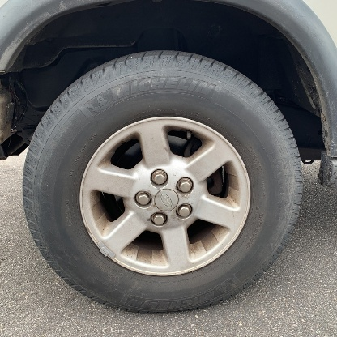

# Tire Data Extraction

## Poster


### 1. Requirements:
```
1. Python 3.5+
2. GPU-enabled debian machine with CUDA 10.0
3. PyTorch bindings for warp-ctc. Instructions can be found here: https://github.com/SeanNaren/warp-ctc
4. sudo apt-get install python3-tk
5. pip3 install -r requirements.txt
```

### 2. Training YOLOv3 (You Only Look Once)

**2a. Command for training with custom dataset:**
```
./darknet detector train data/tire.data cfg/tire.cfg tire.weights
```

**2b. Details of different components:**

* *tire.cfg* can be used as is for further training.

* *tire.weights* are weights after training YOLOv3 on labelled tire images.

* Format of *tire.data*:
```
classes= 1
train  = <path-to-tire-train-txt>/train.txt
valid  = <path-to-tire-validation-txt>/validation.txt
names = data/tire.names
backup = backup
```

* Format of *train.txt* and *validation.txt*
```
/home/akshayve/tire/images/abcd.jpg
/home/akshayve/tire/images/efgh.jpg
```

Folder above(**/home/akshayve/tire/images**) must contain both the images and their corresponding labels text file in YOLO format.

* YOLO format (this is generated by the label tool available in this repository):
```
<object-class> <x> <y> <width> <height>
```

### 3. Training CRNN (Convolutional Recurrent Neural Network)

**3a. Command for training with custom dataset**

```
python3 crnn_main.py --trainroot <path-to-training-dataset> --valroot <path-to-validation-dataset> --cuda --random_sample \
--imgH 32 --displayInterval 50 --valInterval 50 --saveInterval 50 --niter 1000 --nh 256 --adadelta --keep_ratio --lr 0.001 --crnn crnn.pth
```

**3b. Create dataset for training CRNN**

```
python create_dataset.py --imageDir /home/akshayve/crnn/images/train --type train
python create_dataset.py --imageDir /home/akshayve/crnn/images/val --type val
```

Note: Image directory should contain the labelled images generated by the label tool.

### 4. Labelling tool for YOLO and CRNN


* Launch the tool
```
python3 text_extraction/labelTool/tool.py
```

* Enter the location of image directory and click **Load**

* Draw bounding boxes around text regions and then in popup enter text for each region

    **Note**: Click **Next** to make sure image is saved!

### 5. Extract text from image

```
python3 main.py --images /home/akshayve/images/0NPClw4jLF.jpg --saveFolder result
```

* --images: Full path (not relative) to the location where images are stored (can be a single file or directory)

* --saveFolder(Optional): Folder where predictions should be stored

 

